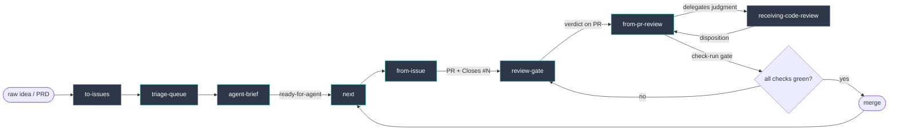

# tracer-workflow

Issue-backed, PR-mediated, evidence-first AI coding workflow. GitHub is the
coordination layer — issues, PRs, comments, and check runs are the source of
truth, not any chat transcript.

Doctrine, the HITL/AFK rule, the evidence-bundle contract, and the check-run gate:
[WORKFLOW.md](./WORKFLOW.md).

## Workflow



Teal = custom (owned here). Gray = adopted (upstream copies, consumed not
authored). `review-gate` runs `requesting-code-review` inside a fresh session and
posts the verdict to the PR.

## Skills and reusable prompts

| Name | Source | Role |
|---|---|---|
| `to-issues` | adopted (Matt Pocock) | idea/PRD → scoped issues, one vertical slice each |
| `triage-queue` | Tracer custom prompt | shallow repository-wide pass over open issues/PRs; recommends queue state without changing GitHub |
| `agent-brief` | Tracer custom prompt | deep single issue/PR triage; writes the durable ready-for-agent / needs-info / wontfix handoff comment |
| `next` | Tracer custom skill | after merge, list open `ready-for-agent` issues with no open blockers |
| `from-issue` | Tracer custom skill | one issue → branch → slice → PR with `Closes #N` + evidence bundle |
| `requesting-code-review` | adopted (REPOZY) | producer: severity-tagged findings + security pass (run by `review-gate`) |
| `receiving-code-review` | adopted (REPOZY) | disposition: fix-now / defer / follow-up / reject / needs-human |
| `review-gate` | Tracer custom skill | fresh-session review posts a SHA-stamped verdict to the PR |
| `from-pr-review` | Tracer custom skill | apply fixes, verify against real check-runs, reply per thread, re-push |

Custom skills are versioned under `skills/`. Plain reusable prompts that are not
runtime skills live under `prompts/`. Adopted skills are upstream copies — extended
through their config seams or routed around, not edited in place. `receiving-code-review`
has no config seam and is used stock; `requesting-code-review` takes review scope
via a root `context-snapshot.json` when present.

## triage-queue and agent-brief

The triage side has two reusable plain prompts, not auto-triggered skills:

1. **Queue pass** — paste `prompts/triage-queue.md` into a web session to evaluate
   many open issues/PRs shallowly. It produces recommendations only: no labels,
   comments, closures, or agent briefs.
2. **Deep brief** — paste `prompts/agent-brief.md` for one selected issue or PR.
   It reads the GitHub artifact deeply and writes the durable triage comment that
   makes `ready-for-agent` safe.

This keeps repository-wide triage useful without weakening the single-issue
contract that `from-issue` consumes.

## review-gate

The review circuit, run so GitHub is the handoff bus — no clipboard relay.

1. **Review** — paste `skills/review-gate/PROMPT.md` into a fresh ChatGPT/Claude
   web session (GitHub connector, comment-write). It runs `requesting-code-review`,
   classifies findings with `receiving-code-review` dispositions, and posts a
   verdict comment to the PR. Fresh session is deliberate: it reviews against the
   issue as written, carrying none of the planning thread's assumptions.

2. **Trigger** — `tooling/review-gate-poller/` polls open PRs for a gate verdict
   whose `head-sha` matches current head. On a fresh `needs-fix`, it shells
   `opencode run` to apply the fix pass via `from-pr-review`. Pushing invalidates
   the verdict (new SHA) and the cycle repeats until `merge-candidate`.

Verdict format and the two load-bearing rules (SHA-staleness, comment-only):
[skills/review-gate/references/verdict-contract.md](./skills/review-gate/references/verdict-contract.md).

Only `needs-fix` triggers autonomous action. `merge-candidate`, `needs-human`, and
`blocked` surface to a human — merge stays manual.

### Poller setup

Requires `bun`, `gh` (authenticated), `opencode` on PATH.

```
# smoke-test by hand first
cd tooling/review-gate-poller
RG_REPO=<owner/repo> RG_WORKDIR=<repo working dir> bun poller.ts

# then install the launchd job (edit paths + env in the plist first)
mkdir -p ~/.local/state/review-gate
cp com.tracer.review-gate-poller.plist ~/Library/LaunchAgents/
launchctl load ~/Library/LaunchAgents/com.tracer.review-gate-poller.plist
```

Env: `RG_REPO` (required), `RG_WORKDIR` (repo dir the fix pass runs in),
`RG_STATE_PATH` (idempotency state, defaults under `~/.local/state`),
`RG_REVIEWER_LOGIN` (optional — restrict verdicts to one author).

Hands-off is bounded by the machine being awake. Asleep = no poll; fallback is
reading the latest gate comment and kicking the session yourself. The verdict is
on GitHub either way.

The poller exits 0 when a run completes; non-zero means a real setup/runtime
error.

## unbacked-work-monitor

Nightly Bun monitor for local-only commits retained by branches or linked
worktrees but not by trusted remote refs. It scans configurable repository roots
recursively, discovers non-bare Git repos, and writes JSON + Markdown reports.
See [`tooling/unbacked-work-monitor/README.md`](./tooling/unbacked-work-monitor/README.md)
for roots-based invocation, output paths, and launchd install notes.
