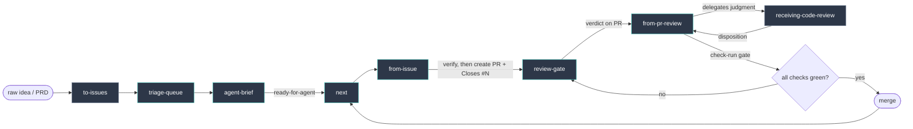

# tracer-workflow

An issue-backed, PR-mediated AI coding workflow. GitHub holds the state —
issues, PRs, comments, check runs. Not the chat transcript.

The failure it's built around: the record drifts from reality. Work exists only
on a laptop and nowhere trusted. A session claims tests pass and the checks say
otherwise. A review approves code, someone pushes, and the approval silently now
refers to a commit that no longer exists.

Each stage closes one of those gaps. Intent becomes an issue. Work becomes a PR
with an evidence bundle. Review runs in a fresh session carrying none of the
planning thread's assumptions, and its verdict is stamped with the head SHA —
push, and the verdict is invalid by construction. Check-run state, not narrated
confidence, decides readiness. A nightly monitor finds commits no remote is
holding.

Sessions are treated as good workers with bad memories: trusted to do the work,
never trusted as the record of it.

Personal workflow, not a product. Deliberately heavier than a small change
warrants — it earns its cost when work spans sessions, needs review, or would be
expensive to misremember.

Doctrine, the HITL/AFK rule, the evidence-bundle contract, and the check-run gate:
[WORKFLOW.md](./WORKFLOW.md).

## Workflow



Teal = custom (owned here). Gray = adopted (upstream copies, consumed not
authored). `from-issue` owns PR creation directly after successful verification;
no branch-outcome menu, optional router, or review tooling may override or
replace that path. `review-gate` runs `requesting-code-review` inside a fresh
session and posts the verdict to the PR.

The same flow as text, with each stage marked:

```
raw idea / PRD
  -> to-issues        adopted   scoped issues, one vertical slice each
  -> triage-queue     custom    shallow repo-wide pass; recommends only
  -> agent-brief      custom    deep single-issue brief -> ready-for-agent
  -> next             custom    pick the next unblocked ready-for-agent issue
  -> from-issue       custom    branch -> slice -> PR + Closes #N + evidence
  -> review-gate      custom    fresh session; runs requesting-code-review
                                (adopted); posts SHA-stamped verdict to the PR
  -> from-pr-review   custom    applies fixes; delegates judgment to
                                receiving-code-review (adopted)
  -> check-run gate             all required checks green at current head SHA?
       green      -> merge (manual) -> back to next
       not green  -> back to review-gate
```

## One issue, end to end

A raw idea goes through `to-issues` and comes out as scoped issues, one vertical
slice each. `triage-queue` does a shallow pass over everything open and
recommends what to look at; `agent-brief` then reads one issue deeply and
produces the durable triage comment that makes `ready-for-agent` safe to apply.
`next` reports which `ready-for-agent` issues have no open blockers.

`from-issue` takes one of them, cuts a branch, implements the slice, and opens a
PR carrying `Closes #N` and an evidence bundle — exact commands and their output,
anchored to the head SHA, rather than a prose claim that things work.

`review-gate` is pasted into a fresh web session with a GitHub connector. It runs
`requesting-code-review`, classifies findings through `receiving-code-review`
dispositions, and posts a verdict comment stamped with the head SHA it reviewed.
The fresh session is the point: it reviews against the issue as written and
carries none of the planning thread's assumptions.

On `needs-fix`, `from-pr-review` applies the fixes, replies per thread, and
pushes. The push moves the head SHA, which invalidates the verdict by
construction, and the circuit runs again. On `merge-candidate` with all required
checks green for the current head, a human merges.

## review-gate

The review circuit, run so GitHub is the handoff bus — no clipboard relay.

1. **Review** — paste `skills/review-gate/PROMPT.md` into a fresh ChatGPT/Claude
   web session (GitHub connector, comment-write). It runs `requesting-code-review`,
   classifies findings with `receiving-code-review` dispositions, and posts a
   verdict comment to the PR. Fresh session is deliberate: it reviews against the
   issue as written, carrying none of the planning thread's assumptions.

2. **Trigger** — `tooling/review-gate-poller/` polls open PRs for a gate verdict
   whose `head-sha` matches current head. On a fresh `needs-fix`, it shells
   `opencode run` to apply the fix pass via `from-pr-review`. Pushing invalidates
   the verdict (new SHA) and the cycle repeats until `merge-candidate`. Install
   and environment variables:
   [`tooling/review-gate-poller/README.md`](./tooling/review-gate-poller/README.md).

Verdict format and the two load-bearing rules (SHA-staleness, comment-only):
[skills/review-gate/references/verdict-contract.md](./skills/review-gate/references/verdict-contract.md).

Only `needs-fix` triggers autonomous action. `merge-candidate`, `needs-human`, and
`blocked` surface to a human — merge stays manual.

## Skills and reusable prompts

| Name | Source | Role |
|---|---|---|
| `to-issues` | adopted (Matt Pocock) | idea/PRD → scoped issues, one vertical slice each |
| `triage-queue` | Tracer custom; installed as ChatGPT skill `gh-triage-queue` | shallow repository-wide pass over open issues/PRs; recommends queue state without changing GitHub |
| `agent-brief` | Tracer custom; installed as ChatGPT skill `agent-brief` | deep single issue/PR triage; produces the durable ready-for-agent / needs-info / wontfix handoff comment |
| `next` | Tracer custom skill | after merge, list open `ready-for-agent` issues with no open blockers |
| `from-issue` | Tracer custom skill | one issue → branch → slice → PR with `Closes #N` + evidence bundle |
| `requesting-code-review` | adopted (REPOZY) | producer: severity-tagged findings + security pass (run by `review-gate`) |
| `receiving-code-review` | adopted (REPOZY) | disposition: fix-now / defer / follow-up / reject / needs-human |
| `review-gate` | Tracer custom skill | fresh-session review posts a SHA-stamped verdict to the PR |
| `from-pr-review` | Tracer custom skill | apply fixes, verify against real check-runs, reply per thread, re-push |

Custom OpenCode skills are versioned under `skills/`. The canonical definitions
for the ChatGPT-web stages live under `prompts/`. Adopted skills are upstream
copies — extended through their config seams or routed around, not edited in
place. `receiving-code-review` has no config seam and is used stock;
`requesting-code-review` takes review scope via a root `context-snapshot.json`
when present.

## triage-queue and agent-brief

The triage side is two stages, shallow then deep. Both are installed as created
ChatGPT skills in the current deployment (`gh-triage-queue`, `agent-brief`); the
canonical definitions live in this repo under `prompts/` and the installed skills
are kept aligned with them by hand.

1. **Queue pass** — `gh-triage-queue`, defined by `prompts/triage-queue.md`,
   evaluates many open issues/PRs shallowly. It produces recommendations only: no
   labels, comments, closures, or agent briefs.
2. **Deep brief** — `agent-brief`, defined by `prompts/agent-brief.md`, reads one
   selected issue or PR deeply and produces the durable triage comment that makes
   `ready-for-agent` safe.

Keeping the installed skills and these definitions in sync — and tightening the
posting, continuation, and supersession contracts — is tracked in #15.

## Tooling

**`tooling/review-gate-poller/`** — Bun poller that watches open PRs for a fresh
`needs-fix` verdict at current head and shells `opencode run` to start the fix
pass. See its [README](./tooling/review-gate-poller/README.md) for setup and
launchd install.

**`tooling/unbacked-work-monitor/`** — nightly Bun monitor for local-only commits
retained by branches or linked worktrees but not by trusted remote refs. It scans
configurable repository roots recursively, discovers non-bare Git repos, and
writes JSON + Markdown reports. See
[`tooling/unbacked-work-monitor/README.md`](./tooling/unbacked-work-monitor/README.md)
for roots-based invocation, output paths, and launchd install notes.
