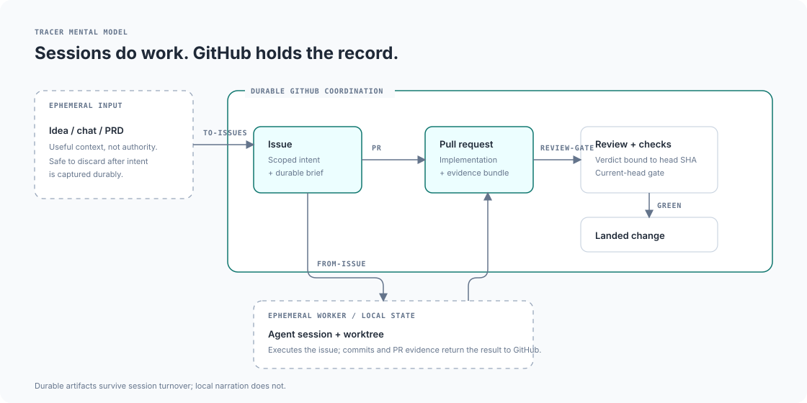
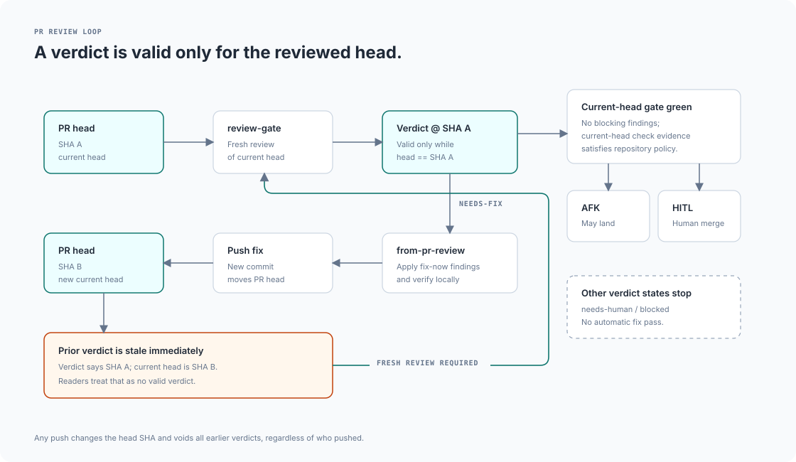

# tracer-workflow

An issue-backed, PR-mediated AI coding workflow. GitHub holds durable state in
issues, PRs, comments, and check runs. Chat transcripts are disposable.

The workflow exists because the record drifts from reality. Work can exist only
on a laptop and nowhere trusted. A session can claim tests pass while the checks
say otherwise. A review can approve code, then a later push leaves that approval
attached to an old commit.

Each stage closes one of those gaps. Intent becomes an issue. Work becomes a PR
with an evidence bundle. Review runs in a fresh session carrying none of the
planning thread's assumptions, and its verdict is stamped with the head SHA.
Push a new commit and the verdict becomes stale automatically. Check-run state,
rather than narrated confidence, decides readiness. A nightly monitor finds
commits no trusted remote holds.

Sessions are good workers with bad memories. They can do the work, but GitHub is
the record.

This is a personal workflow. It is deliberately heavier than a small change
warrants, and earns its cost when work spans sessions, needs review, or would be
expensive to misremember.

Vocabulary is defined once in [CONTEXT.md](./CONTEXT.md). [WORKFLOW.md](./WORKFLOW.md)
defines the HITL/AFK rule, evidence-bundle contract, slice contract, check-run
gate, the `from-issue` execution-stage contract, and the full stage table.

## Trust architecture

The system separates disposable workers, durable authored GitHub records, and
observed repository state. Sessions and agents can perform work, but later stages
reconstruct authority from GitHub rather than trusting prior narration.

Source-backed architecture, provenance, drift, and the editable models live in [`docs/architecture/`](./docs/architecture/). The diagram source and visual constraints are documented in [`docs/diagrams/README.md`](./docs/diagrams/README.md).

The critical review rule is commit identity, not conversation continuity: a
verdict about SHA A cannot authorize work on SHA B. A new push returns the PR to
fresh review even when the implementation session itself continues.

## One issue, end to end

A raw idea goes through `to-issues` and comes out as scoped issues, one vertical
slice each. `triage-queue` does a shallow pass over everything open and
recommends what to inspect; `agent-brief` then reads one issue deeply and
produces the durable triage comment that makes the issue safe to hand to an
agent. `next` reports which of those issues have no open blockers.

`from-issue` is the execution stage for a `ready-for-agent` issue, or for a
validated pasted implementation handoff / durable agent brief that has been
accepted as equivalent execution input. It resumes the existing issue/worktree
when one exists, otherwise it cuts a branch, implements the slice, and opens a
PR carrying `Closes #N` and an evidence bundle — exact commands and their
output, anchored to the head SHA, rather than a prose claim that things work.

Once action-ready input is accepted, nested brainstorming/planning/`using-superpowers`
steps are subordinate subroutines and must return control to execution. An
ordinary approval gate does not end the run unless it names a concrete
unresolved blocker that is absent from the issue or brief. Multi-file scope, UI
impact, a desire for planning, or a nested skill's default approval checkpoint
are not blockers by themselves. A handoff-only result is allowed only for
genuine blockers or verified failures that cannot be recovered locally. The
allowed terminal outcomes are: PR opened with closing issue reference + evidence
bundle; existing PR/worktree resumed and advanced; explicit durable blocker
naming the exact missing prerequisite or decision; verified failure with the
exact recovery state persisted.

`review-gate` is pasted into a fresh web session with a GitHub connector. It runs
`requesting-code-review`, classifies findings through `receiving-code-review`
dispositions, and posts a verdict comment stamped with the reviewed head SHA. A
fresh session reviews the issue as written without carrying assumptions from the
planning thread.

On a `needs-fix` verdict, `from-pr-review` applies the fixes, replies per thread,
and pushes. The push moves the head SHA and invalidates the verdict, so the
circuit runs again. `needs-human` and `blocked` are hard stops. Once a current-head
`merge-candidate` verdict and the check-run gate agree, landing authority follows
the issue's autonomy tag: AFK work may land autonomously; HITL work stops for the
human merge button. The gate follows the current head's required status-check
configuration: if required checks are configured, all applicable required checks
must be green at the current head and at least one applicable required check must
exercise the changed paths; if no required checks are configured, at least one
green CI/check run on the current head must exercise the changed paths.
Older-head results never count.

### Reader-facing diagrams

The figures in `docs/diagrams/` stay intentionally simple; they are the primary
visuals in this README. Their editable source and editorial rules live in
[`docs/diagrams/README.md`](./docs/diagrams/README.md).

## Where things live

Custom skills are versioned under `skills/`; this repo is their canonical source.
The canonical definitions for the ChatGPT-web stages live under `prompts/`. The
installed ChatGPT skills are kept aligned with them by hand. Issue #15 tracks
tighter parity plus the posting and supersession contracts around it.

Adopted skills are upstream copies. They are extended through their config seams
or routed around, never edited in place. `receiving-code-review` has no config
seam and is used stock; `requesting-code-review` takes review scope from a root
`context-snapshot.json` when present.

The full stage table, including every skill, owner, and role, is in
[WORKFLOW.md](./WORKFLOW.md).

## Tooling

**`tooling/review-gate-poller/`**: Bun poller that watches open PRs for a fresh
`needs-fix` verdict at the current head and shells `opencode run` to start the
fix pass. The poller only triggers current-head `needs-fix` repair; it does not
infer or override the issue's AFK/HITL landing authority. See its
[README](./tooling/review-gate-poller/README.md) for environment variables and
launchd install.

**`tooling/unbacked-work-monitor/`**: nightly Bun monitor for local-only commits
retained by branches or linked worktrees but not by trusted remote refs. It scans
configured repository roots recursively, discovers non-bare Git repos, and
writes JSON plus Markdown reports. See
[`tooling/unbacked-work-monitor/README.md`](./tooling/unbacked-work-monitor/README.md)
for roots-based invocation, output paths, and launchd install notes.

Verdict format and the two load-bearing review-gate rules, SHA-staleness and
comment-only operation, are defined in
[skills/review-gate/references/verdict-contract.md](./skills/review-gate/references/verdict-contract.md).
